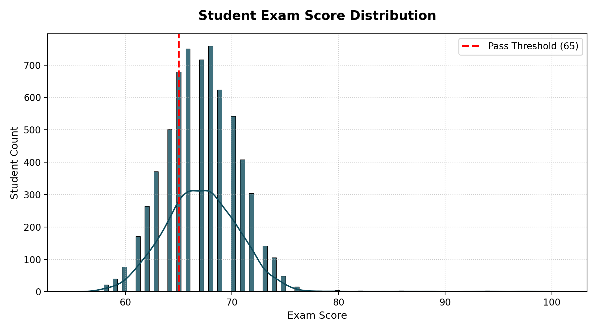
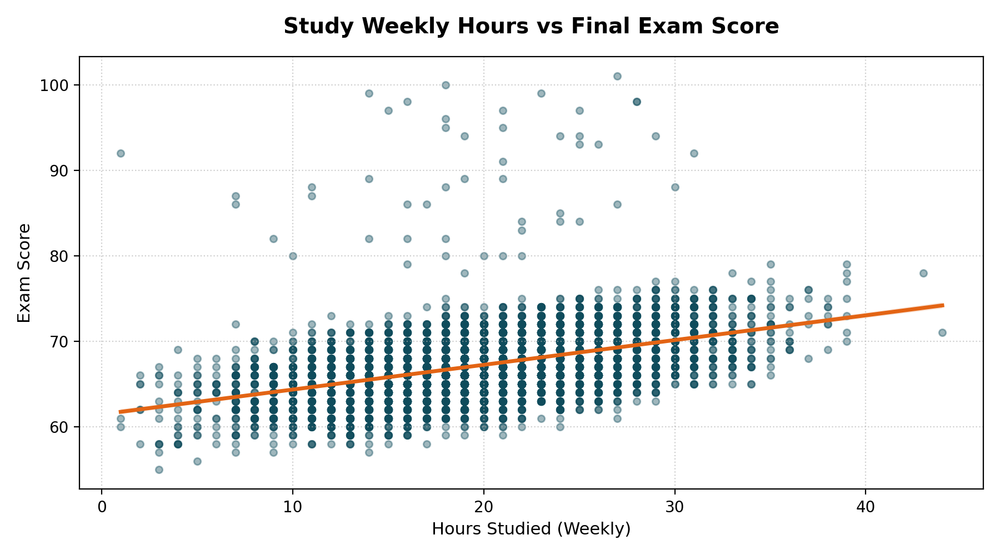
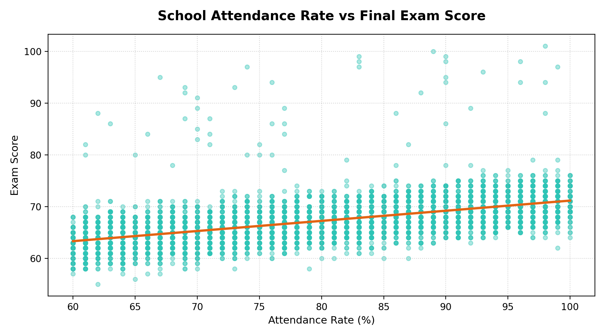
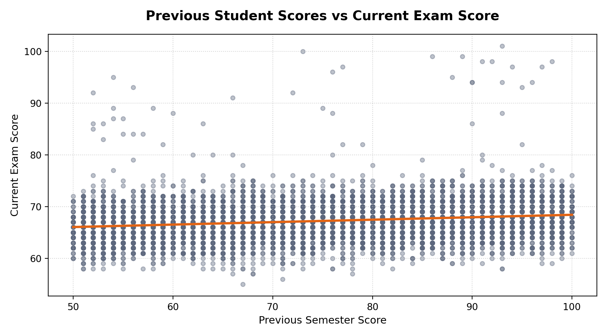
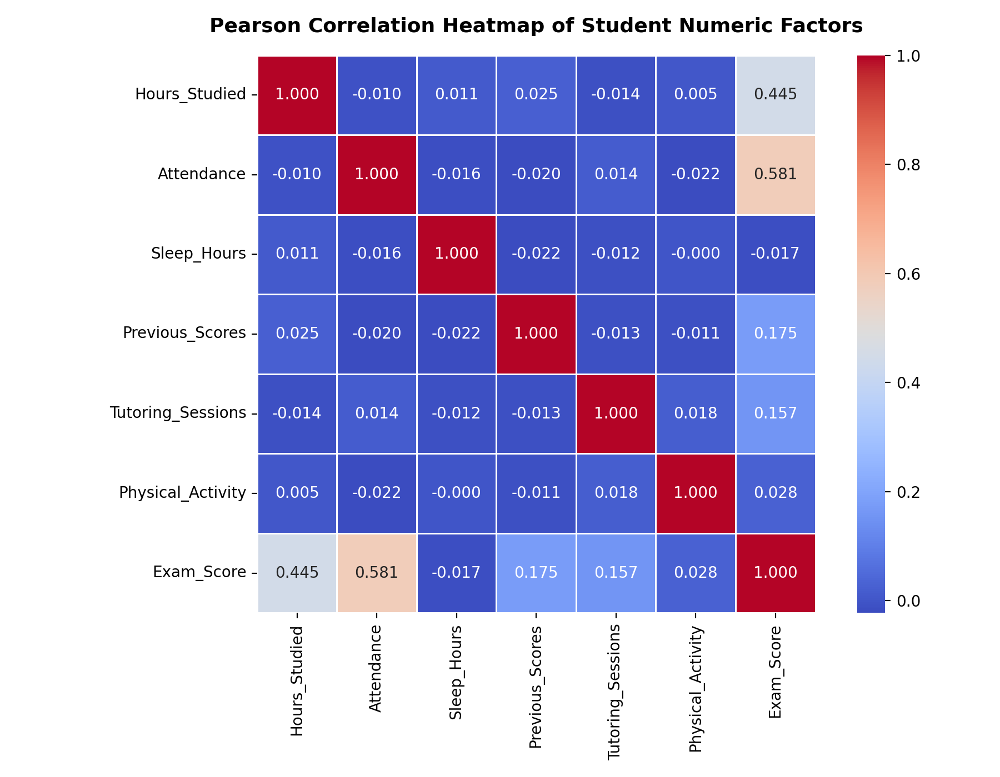
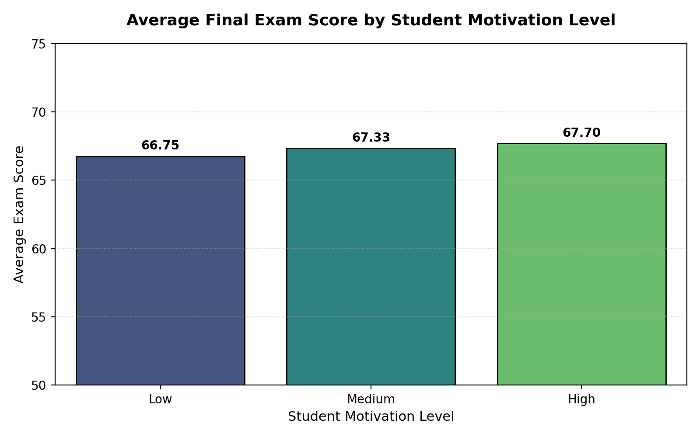
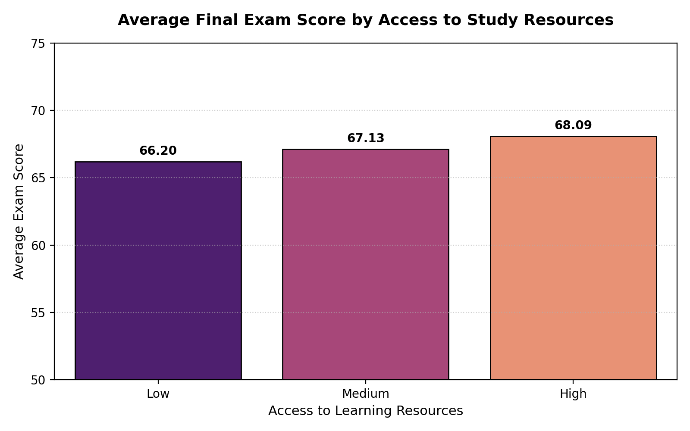
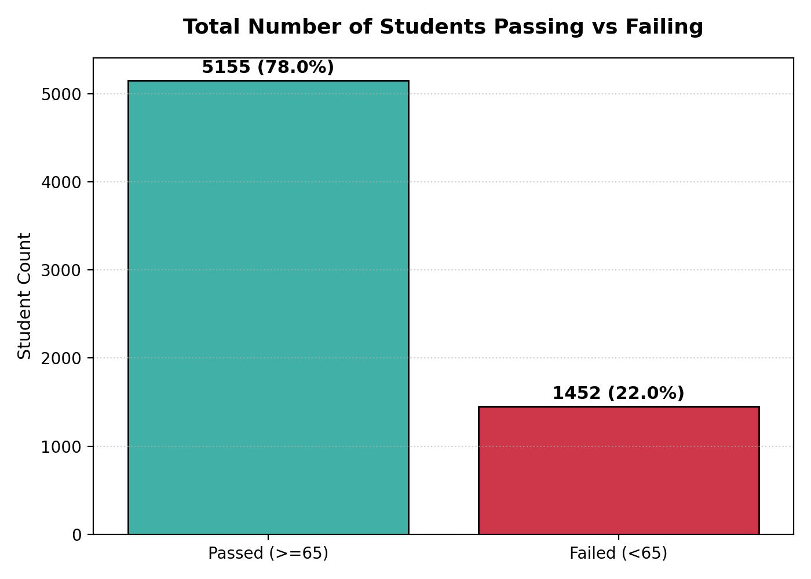
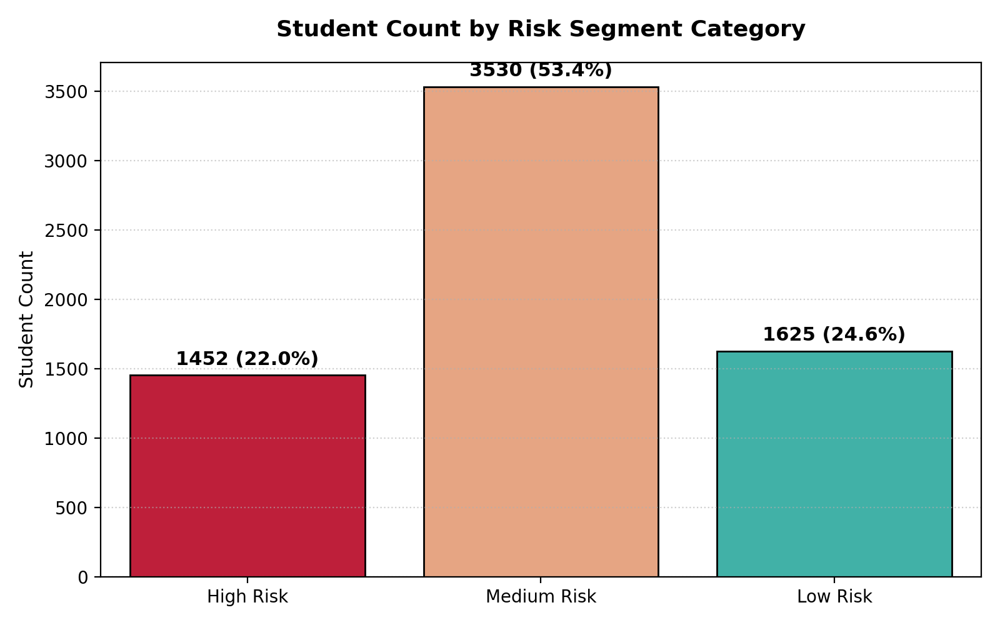
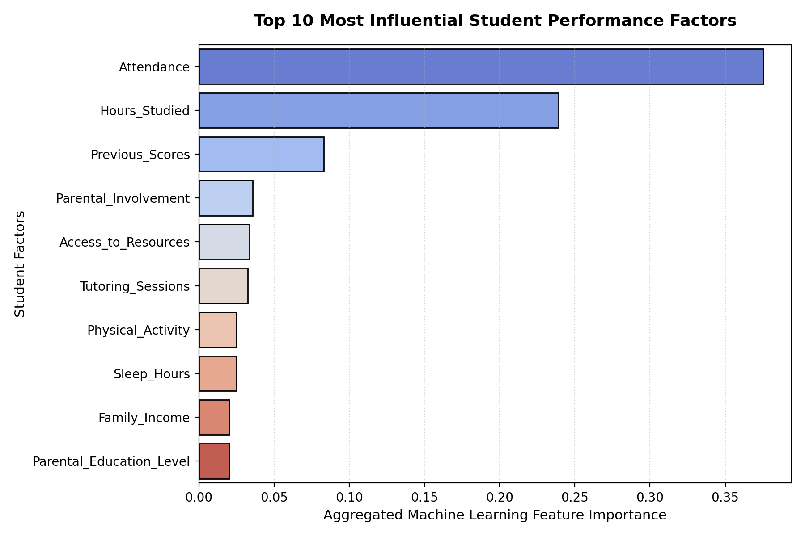

# Student Performance Analytics & Diagnostic System

An AI-assisted, statistically-validated framework for predicting student exam results, assessing academic risks, and delivering personalized, supportive feedback using machine learning and GenAI.

---

## Table of Contents

- [Project Overview](#project-overview)
- [Dataset](#dataset)
- [Project Structure](#project-structure)
- [Setup & Installation](#setup--installation)
- [How to Run](#how-to-run)
- [Exploratory Data Analysis](#exploratory-data-analysis)
- [Feature Engineering](#feature-engineering)
- [Machine Learning Models](#machine-learning-models)
- [Simplified Score Estimator Formula](#simplified-score-estimator-formula)
- [Student Risk Segmentation](#student-risk-segmentation)
- [Streamlit Web Application](#streamlit-web-application)
- [FastAPI Backend](#fastapi-backend)
- [SQL Analytics](#sql-analytics)
- [GenAI Feedback Reports](#genai-feedback-reports)
- [Charts & Visualizations](#charts--visualizations)
- [Limitations & Future Work](#limitations--future-work)

---

## Project Overview

This project analyzes a dataset of **6,607 student profiles** across **20 attributes** to understand what factors most influence exam performance. It delivers:

- **Predictive models** for estimating exam scores and classifying pass/fail outcomes
- **Risk segmentation** to identify students needing academic support
- **An interactive Streamlit dashboard** for real-time student diagnostics
- **A FastAPI backend** serving ML predictions and AI coaching via REST endpoints
- **Aura** — a GenAI-powered academic success coach (built on Gemini) that generates personalized, week-by-week improvement plans

---

## Dataset

| Property | Value |
|---|---|
| File | `StudentPerformanceFactors.csv` |
| Records | 6,607 students |
| Features | 20 columns |
| Target Variable | `Exam_Score` |
| Score Range | 55 – 101 marks |
| Average Score | 67.24 marks |
| Pass Threshold | ≥ 65 marks |
| Pass Rate | 78.02% (5,155 passed / 1,452 failed) |

### Dataset Columns

| Column | Type | Description |
|---|---|---|
| `Hours_Studied` | Numeric | Weekly independent study hours |
| `Attendance` | Numeric | School attendance rate (%) |
| `Parental_Involvement` | Categorical | High / Medium / Low |
| `Access_to_Resources` | Categorical | High / Medium / Low |
| `Extracurricular_Activities` | Categorical | Yes / No |
| `Sleep_Hours` | Numeric | Average nightly sleep hours |
| `Previous_Scores` | Numeric | Prior semester score (%) |
| `Motivation_Level` | Categorical | High / Medium / Low |
| `Internet_Access` | Categorical | Yes / No |
| `Tutoring_Sessions` | Numeric | External tutoring sessions per month |
| `Family_Income` | Categorical | High / Medium / Low |
| `Teacher_Quality` | Categorical | High / Medium / Low |
| `School_Type` | Categorical | Private / Public |
| `Peer_Influence` | Categorical | Positive / Neutral / Negative |
| `Physical_Activity` | Numeric | Exercise days per week |
| `Learning_Disabilities` | Categorical | Yes / No |
| `Parental_Education_Level` | Categorical | Postgraduate / College / High School |
| `Distance_from_Home` | Categorical | Near / Moderate / Far |
| `Gender` | Categorical | Female / Male |
| `Exam_Score` | Numeric | **Target** — Final exam score |

---

## Project Structure

```
StudPerf2/
│
├── StudentPerformanceFactors.csv        # Raw dataset (6,607 records)
├── cleaned_student_performance.csv      # Cleaned & feature-engineered dataset
├── student_performance_models.pkl       # Trained ML models (pickle bundle)
├── linear_regression_results.csv        # LR coefficient significance table
├── model_metrics.csv                    # Model comparison metrics
│
├── run_analysis.py                      # Main analysis pipeline (EDA + training)
├── app.py                               # Streamlit web application
├── api.py                               # FastAPI REST backend
├── dashboard.html                       # Static HTML dashboard
│
├── sql_queries.sql                      # SQL schema + analytics queries
├── feedback_reports.txt                 # 5 AI-generated student feedback samples
│
├── eda_summary.md                       # EDA insights summary
├── final_summary.md                     # Full project summary
├── presentation_guide.md                # Slide-by-slide presentation guide
│
├── requirements.txt                     # Streamlit app dependencies
├── requirements_api.txt                 # FastAPI backend dependencies
├── Procfile                             # Deployment process file
├── project.env                          # Environment variables (API keys)
│
└── charts/                              # Generated visualizations (10 charts)
    ├── 1_exam_score_distribution.png
    ├── 2_study_time_vs_exam_score.png
    ├── 3_attendance_vs_exam_score.png
    ├── 4_previous_scores_vs_exam_score.png
    ├── 5_correlation_heatmap.png
    ├── 6_average_score_by_motivation_level.png
    ├── 7_average_score_by_access_to_resources.png
    ├── 8_pass_fail_count.png
    ├── 9_risk_segment_breakdown.png
    └── 10_top_factors_summary.png
```

---

## Setup & Installation

### Prerequisites

- Python 3.10+
- A valid [Google Gemini API key](https://aistudio.google.com/app/apikey) (for the Aura chatbot)

### 1. Clone the repository

```bash
git clone <repository-url>
cd StudPerf2
```

### 2. Install dependencies

**For the Streamlit app:**
```bash
pip install -r requirements.txt
```

**For the FastAPI backend:**
```bash
pip install -r requirements_api.txt
```

### 3. Configure environment variables

Edit `project.env` and add your Gemini API key:

```env
GEMINI_API_KEY=AIzaSy...your_key_here
```

---

## How to Run

### Step 1 — Run the analysis pipeline (required first)

This trains all ML models, generates charts, and creates the cleaned dataset:

```bash
python run_analysis.py
```

Outputs produced:
- `cleaned_student_performance.csv`
- `student_performance_models.pkl`
- `model_metrics.csv`
- `linear_regression_results.csv`
- `sql_queries.sql`
- `feedback_reports.txt`
- All 10 charts in `charts/`

### Step 2a — Launch the Streamlit dashboard

```bash
streamlit run app.py
```

### Step 2b — Launch the FastAPI backend

```bash
uvicorn api:app --reload --port 8000
```

API documentation available at `http://localhost:8000/docs`

---

## Exploratory Data Analysis

Key correlation findings between features and `Exam_Score`:

| Feature | Pearson Correlation | Relationship |
|---|---|---|
| Attendance | **0.5811** | Strong Positive |
| Hours_Studied | **0.4455** | Moderate Positive |
| Previous_Scores | 0.1751 | Weak Positive |
| Tutoring_Sessions | 0.1565 | Weak Positive |
| Physical_Activity | 0.0278 | Negligible |
| Sleep_Hours | -0.0170 | Negligible |

**Key insight:** Attendance and study hours are the two strongest controllable drivers of exam performance.

### Socio-Environmental Averages

| Factor | Group | Average Score |
|---|---|---|
| Motivation Level | High | 67.70 |
| Motivation Level | Medium | 67.33 |
| Motivation Level | Low | 66.75 |
| Access to Resources | High | 68.09 |
| Access to Resources | Medium | 67.13 |
| Access to Resources | Low | 66.20 |
| Gender | Female | 67.24 |
| Gender | Male | 67.23 |
| School Type | Private | 67.29 |
| School Type | Public | 67.21 |

---

## Feature Engineering

Five engineered columns were added to the cleaned dataset:

| Feature | Description |
|---|---|
| `Pass_Flag` | Binary: 1 if Exam_Score ≥ 65, else 0 |
| `Risk_Level` | High Risk (< 65), Medium Risk (65–69), Low Risk (≥ 70) |
| `Study_Category` | Low (< 15 hrs), Medium (15–24 hrs), High (≥ 25 hrs) |
| `Attendance_Category` | Low (< 70%), Medium (70–84%), High (≥ 85%) |
| `Previous_Performance_Category` | Low (< 65), Medium (65–84), High (≥ 85) |

---

## Machine Learning Models

### Regression Models (Predicting Exam Score)

| Model | MAE | RMSE | R² |
|---|---|---|---|
| **Full Linear Regression** | **0.4524** | **1.8044** | **0.7696** |
| Random Forest Regressor | 1.0841 | 2.1657 | 0.6682 |
| Simplified Equation Model | 1.2642 | — | 0.6422 |

**Linear Regression is the best-performing model** — student performance in this dataset follows highly additive, linear patterns.

### Classification Model (Pass/Fail Prediction)

| Metric | Score |
|---|---|
| Accuracy | **90.77%** |
| Precision | 0.9068 |
| Recall | 0.9847 |
| F1-Score | 0.9441 |
| ROC-AUC | **0.9686** |

### Statistically Significant Coefficients (Linear Regression)

| Factor | Coefficient | p-value | Significance |
|---|---|---|---|
| Hours_Studied | +0.2932 per hour | 0.0000 | Highly Significant |
| Attendance | +0.1989 per % point | 0.0000 | Highly Significant |
| Tutoring_Sessions | +0.5077 per session | 0.0000 | Highly Significant |
| Physical_Activity | +0.1925 per day | 0.0000 | Highly Significant |
| Previous_Scores | +0.0490 per point | 0.0000 | Highly Significant |
| Sleep_Hours | -0.0125 | 0.5266 | Not Significant |
| School_Type (Public) | +0.0172 | 0.7841 | Not Significant |
| Gender (Male) | -0.0257 | 0.6589 | Not Significant |

---

## Simplified Score Estimator Formula

A practical, teacher-friendly formula built from the 5 key behavioral factors (R² = 0.642):

```
Estimated Score ≈ 40.73
  + 0.2891 × (Hours Studied / week)
  + 0.1988 × (Attendance %)
  + 0.0483 × (Previous Score %)
  + 0.5102 × (Tutoring Sessions / month)
  + 0.1507 × (Physical Activity days / week)
```

**Example:** A student with 18 hrs/week study, 90% attendance, 75% previous score, 2 tutoring sessions, 3 exercise days:

> Score ≈ 40.73 + 5.20 + 17.89 + 3.62 + 1.02 + 0.45 ≈ **68.9 marks**

---

## Student Risk Segmentation

| Segment | Threshold | Count | Percentage |
|---|---|---|---|
| Low Risk | Score ≥ 70 | 1,625 | 24.60% |
| Medium Risk | 65 ≤ Score < 70 | 3,530 | 53.43% |
| High Risk | Score < 65 | 1,452 | 21.98% |

The largest group (53%) sits in the medium-risk zone — borderline students who can improve significantly with targeted intervention.

---

## Streamlit Web Application

The `app.py` dashboard provides four tabs:

### Tab 1 — AI Predictive Diagnostic
- Real-time exam score prediction (Linear Regression, MAE ± 0.45 marks)
- Pass probability gauge (Random Forest Classifier, AUC = 0.97)
- Risk segment badge (Low / Medium / High Risk)
- Auto-generated personalized diagnostic report with strengths, improvement areas, and an action plan

### Tab 2 — Model Comparative Analytics
- Side-by-side model leaderboard table
- Interactive simplified formula estimator
- Visual comparison of Linear Regression vs. equation-based predictions

### Tab 3 — Student Data Explorer
- Load and browse the cleaned dataset
- Group-by analysis: compare average scores across any categorical variable
- Dynamic bar chart visualization

### Tab 4 — Aura: GenAI Academic Success Coach
- 10-question interactive chatbot collecting the student's academic profile
- Powered by Google Gemini (Gemma-4-26b-a4b-it with fallback to Gemini-2.5-flash)
- Generates a structured coaching report including:
  - Performance snapshot
  - Key strengths and growth areas
  - 4-week improvement plan
  - Atomic habits to adopt
  - SMART goal and WOOP motivation framework
  - Time management advice (when needed)
- Free-form follow-up chat after the initial report

---

## FastAPI Backend

`api.py` exposes three REST endpoints:

| Endpoint | Method | Description |
|---|---|---|
| `/predict` | POST | Run ML models on a student profile, returns score + pass probability |
| `/chat` | POST | Stream a Gemini coaching response via Server-Sent Events |
| `/health` | GET | Liveness probe |

Start the server:
```bash
uvicorn api:app --reload --port 8000
```

Interactive API docs: `http://localhost:8000/docs`

---

## SQL Analytics

`sql_queries.sql` contains a complete analytical SQL script:

- **DDL**: Table creation schema for the student performance database
- **Performance queries**: Score breakdowns by study category, tutoring sessions, and prior scores
- **Pass rate queries**: Dynamic pass rate by attendance band, school type, and gender
- **Intersectional analysis**: Cross-tabulation of motivation level vs. resource access
- **At-risk identification**: Query to fetch high-risk students needing urgent intervention

---

## GenAI Feedback Reports

`feedback_reports.txt` contains **5 sample AI-generated student feedback reports**, each:

- Provides an estimated exam score and pass probability from the ML models
- Identifies 2 genuine strengths based on the student's controllable behaviors
- Flags 2 specific improvement areas
- Suggests 3 concrete, actionable steps (120–180 words per report)
- Avoids blame, bias, and sensitive demographic framing

---

## Charts & Visualizations

All charts are generated by `run_analysis.py` and saved in the `charts/` folder.

### Chart 1 — Exam Score Distribution


Distribution of final exam scores across all 6,607 students. The distribution is roughly normal, centered around 67 marks, with the pass threshold at 65.

---

### Chart 2 — Study Time vs Exam Score


Scatter plot showing the positive linear relationship between weekly study hours and exam scores. Correlation: **r = 0.4455**.

---

### Chart 3 — Attendance vs Exam Score


Scatter plot demonstrating that attendance is the single strongest behavioral predictor. Correlation: **r = 0.5811**.

---

### Chart 4 — Previous Scores vs Exam Score


Relationship between prior academic performance and current exam scores. Correlation: **r = 0.1751**.

---

### Chart 5 — Correlation Heatmap


Full Pearson correlation matrix across all numeric features. Attendance and Hours_Studied show the strongest positive correlations with Exam_Score.

---

### Chart 6 — Average Score by Motivation Level


Comparison of average exam scores across High, Medium, and Low motivation groups. High motivation students average **67.70** vs. **66.75** for low motivation.

---

### Chart 7 — Average Score by Access to Resources


Students with high access to study resources score **68.09** on average vs. **66.20** for low access — a 1.89 mark gap.

---

### Chart 8 — Pass/Fail Count


Bar chart showing the pass/fail split: **5,155 students passed** (78.02%) and **1,452 failed** (21.98%).

---

### Chart 9 — Risk Segment Breakdown


Pie/bar chart of the three risk segments: Low Risk (24.60%), Medium Risk (53.43%), High Risk (21.98%).

---

### Chart 10 — Top Factors Summary


Summary visualization of the top predictive factors ranked by their absolute correlation and regression coefficient significance.

---

## Limitations & Future Work

- **Socio-cultural context**: Features like family income and parental education are included for demographic insight only. Models must focus on controllable behaviors — using background factors for predictions about individual student potential would be ethically inappropriate.
- **Single-semester snapshot**: The dataset is a one-time cross-section. Longitudinal tracking (multiple semesters, weekly quizzes) would enable real-time early warning systems.
- **Linear dominance**: Tree-based models underperformed Linear Regression (R² 0.67 vs 0.77), confirming that student performance in this dataset is highly additive and linear.
- **Future integrations**: Automated email/SMS delivery of Aura feedback reports directly to students and parents; real-time dashboard with live score tracking.
